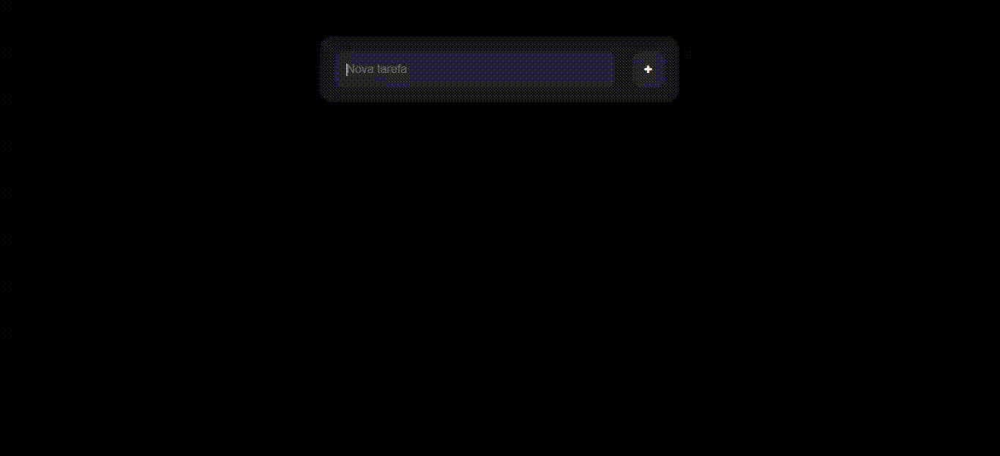

# LISTA TO DO

Esse é um projeto para colocar em prática MAIS alguns conhcimentos em Javascript da melhor forma.

## Índice

- [Visão geral](#visão-geral)
  - [O desafio](#o-desafio)
  - [Captura de tela](#captura-de-tela)
  - [Links](#links)
- [Meu processo](#meu-processo)
  - [Construído com](#construído-com)
  - [O que aprendi](#o-que-aprendi)
  - [Desenvolvimento contínuo](#desenvolvimento-contínuo)
- [Autor](#autor)
- [Agradecimentos](#acknowledgments)

## Visão geral

### O desafio

O usuário irá:

- Criar tarefas.
- Editar tarefas criadas.
- Excluir tarefas.

### Captura de tela

### Links

## Meu processo

### Construído com

- Marcação HTML5
- Propriedades personalizadas CSS
- Flexbox
- Javascript para efetuar todas as funcionalidades.

### O que eu aprendi

  - Foi um desafio fazer a construção de edição dos dados informados e salvar uma nova informação.
  

### Desenvolvimento contínuo

  - A idealização da estrutura ainda é trbalhosa.

## Autor

- Website - [Hudney Brito](https://hudney-fsbrito.github.io/Hudney-Brito-Portfolio-/)
